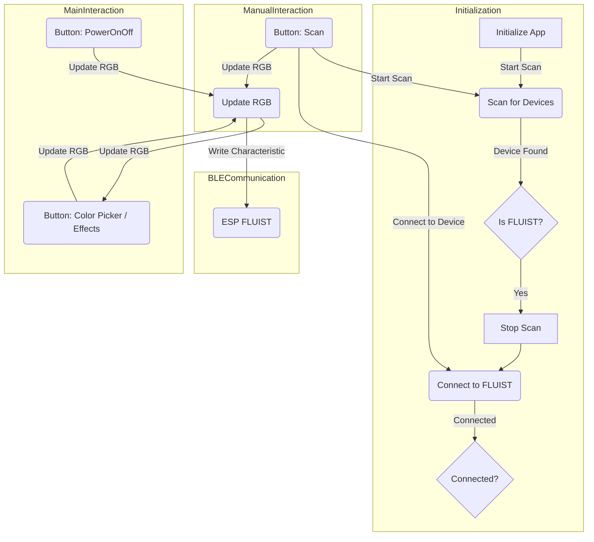

# Stained Fluist Android App

The Flutter app, named "Stained Fluist," initializes by scanning for BLE devices, specifically targeting the FLUIST device. Once found, it connects to FLUIST, enabling interaction with RGB LED effects. The main screen features buttons for manual interactions, such as initiating a scan, connecting to the device, and updating RGB values. Users can power on/off the device, open a color picker, or select predefined effects. The app communicates with the ESP FLUIST device, updating its state and triggering corresponding visual effects.

## Getting Started

### Setting Persmissions

Setting permissions locally on the phone is a crucial step in working with Bluetooth on mobile devices, including BLE in the context of your Flutter app. Permissions are necessary to access Bluetooth features, and they are platform-specific.

For this hole the `app icon` and open `app-info`. Select `app authorization`. Everythink shall be set to true.

In the Android settings You need to add the following permissions to your AndroidManifest.xml file:

    <uses-permission android:name="android.permission.BLUETOOTH_SCAN" android:usesPermissionFlags="neverForLocation" />
    <uses-permission android:name="android.permission.BLUETOOTH_CONNECT" />
    <uses-permission android:name="android.permission.ACCESS_FINE_LOCATION" android:maxSdkVersion="30" />
    <uses-permission android:name="android.permission.ACCESS_COARSE_LOCATION" android:maxSdkVersion="30" />

More details can be found in the [ReactiveBle-Git-Repo](https://github.com/PhilipsHue/flutter_reactive_ble)

### Get Packages

to get all used Packages to run the app just click `Get Packages` in the upper right corne in the `pubspec.yaml` file or run the following to install missing packages.

    flutter pub get

## App

We are starting the app development with no glue.

Actualle we just use the example code from ReactiveBle and modify it till ti fits our needs. We achive this with tiers and the help of ChatGPT.
First we esteplish the connection. This happens eather manually or automathacly when starting the app.

After scanning for the better half The ESP named Flutter we try to connect with this fellow. After the connection is assteblished. We can than send RGB and PowerOnOff information with BLE.

