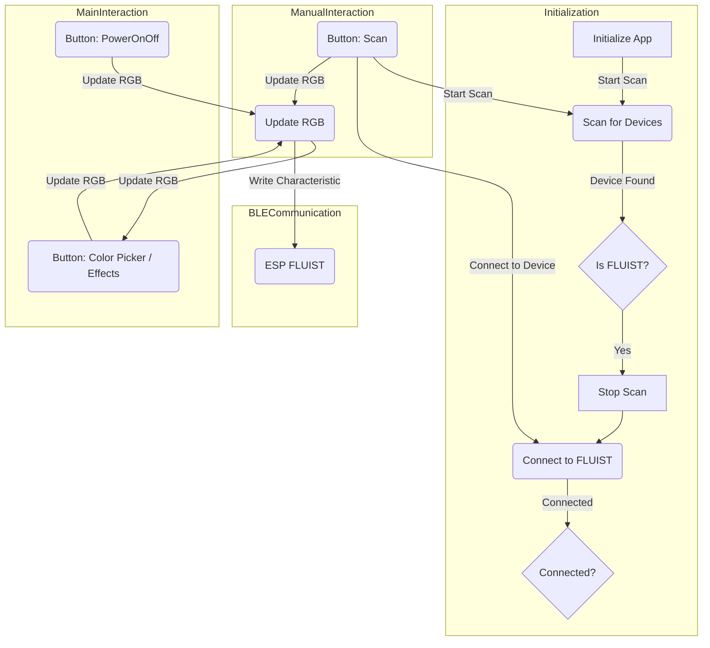

# app_fluist

A new Flutter project.

## Getting Started

This project is a starting point for a Flutter application.

A few resources to get you started if this is your first Flutter project:

- [Lab: Write your first Flutter app](https://docs.flutter.dev/get-started/codelab)
- [Cookbook: Useful Flutter samples](https://docs.flutter.dev/cookbook)

<<<<<<< HEAD
In the Android settings You need to add the following permissions to your AndroidManifest.xml file:

```dart
    <uses-permission android:name="android.permission.BLUETOOTH_SCAN" android:usesPermissionFlags="neverForLocation" />
    <uses-permission android:name="android.permission.BLUETOOTH_CONNECT" />
    <uses-permission android:name="android.permission.ACCESS_FINE_LOCATION" android:maxSdkVersion="30" />
    <uses-permission android:name="android.permission.ACCESS_COARSE_LOCATION" android:maxSdkVersion="30" />
```

More details can be found in the [ReactiveBle-Git-Repo](https://github.com/PhilipsHue/flutter_reactive_ble)

### Get Packages

to get all used Packages to run the app just click `Get Packages` in the upper right corne in the `pubspec.yaml` file or run the following to install missing packages.

```terminal
    flutter pub get
```

## App

We are starting the app development with no glue.

Actualle we just use the example code from ReactiveBle and modify it till ti fits our needs. We achive this with tiers and the help of ChatGPT.
First we esteplish the connection. This happens eather manually or automathacly when starting the app.

After scanning for the better half The ESP named Flutter we try to connect with this fellow. After the connection is assteblished. We can than send RGB and PowerOnOff information with BLE.

### Characteristic

The written data into the Characteristic looks like following which will be converted into:

```c
    New Message (Hex): 1ff6d2117 -> eARGB: 1 255 109 33 23
```

| data  | Effects | Alpha   | Red     | Green   | Blue    |
| ----- | ------- | ------- | ------- | ------- | ------- |
| eARGB | 1       | 255     | 109     | 33      | 23      |
|       |         |         |         |         |         |
| eARGB | 0 - 9   | 0 - 255 | 0 - 255 | 0 - 255 | 0 - 255 |
|       |         |         |         |         |         |

The Effects are defined like following:

```c
    enum rgbEffect
    {
        OFF,             // OFF   - set off state as an effect to simplify
        BASIC,           // BASIC - soid one filled color
        FADE,            // FADE  - a fade thorugh the hue colors
        RAINBOW,         // RNBW  - rainbow effect hole spectrum
        RAINBOWGLITTER,  // RGGL  - rainbow with some random glitter 
        CONFETTI,        // CNFT  - rainbow colors but random
        RUNNINGLIGHT,    // RUNL  - running light from 0 to 100
        JUGGLE,          // JGL   - colored dots, weaving in and out in sync
        SINELON,         // SNLN  - colored dot sweeping back and forth
        STATIONARY       // STAT  - local effect triggerd by esp button
    };
```


=======
For help getting started with Flutter development, view the
[online documentation](https://docs.flutter.dev/), which offers tutorials,
samples, guidance on mobile development, and a full API reference.
>>>>>>> parent of 4fb1247 (:memo: add documentatoin to app readme in APP_FLUIST)
